# Data2AITextbook

## 🎯 Goal

> Automatically convert unstructured data into a high-quality 'textbook' format, optimized for fine-tuning Large Language Models (LLMs) 🚀

## About

Inspired by [Textbooks Are All You Need](https://arxiv.org/pdf/2306.11644.pdf), which produced [`phi-1`](https://huggingface.co/microsoft/phi-1) LLM trained with "textbook quality" data.

### Principles

- **Flexible**: Any form of unstructured data (e.g. speeches, blogs, code, existing texbooks, etc)
- **Grounded**: Trusts your data over model's pre-existing knowledge and doesn't make up new data unless explicitly asked
- **Efficient**: Highest density of learning-per-training-token, leverage best practices & undestands of language model training
- **Enhanced**: Increase capabilities of trained models versus simply training on the raw input text

## Phases

This project is broken into 2 phases:
- **Ingestion & Generation**: Extract learning objectives; generate high-quality 1️⃣ lessons and 2️⃣ exercises per knowledge type and cognitive process; knowledge augmentation (e.g. paraphrase, inverse, etc).
- **Training**: Curriculum learning to optimally train a new language model. Training should get progressively harder and leverage knowledge learned earlier in the curriculum.

### 1. Ingestion & Generation

- **Input**: Unstructured text data
- **Output**: Training & test dataset, with rich meta-data (e.g. dependencies/relationships, knowledge type, cognitive process, etc)

🤝 Combining the best practices from teaching humans and training language models.

Inspiration for educating:
- Humans:
    - Bloom's Taxonomy for learning objectives
        - Learn more about Bloom's Taxonomy in https://www.celt.iastate.edu/instructional-strategies/effective-teaching-practices/revised-blooms-taxonomy/ and https://cft.vanderbilt.edu/guides-sub-pages/blooms-taxonomy/
    - Curricium Learning
    - Encoding Specificity Principle
- Language models:
    - Prompting/Inference
        - [Chain of Thought](https://arxiv.org/abs/2201.11903)
        - [Graph of Thoughts](https://arxiv.org/abs/2308.09687)
        - [Self Consistency](https://arxiv.org/abs/2203.11171)
    - Training datasets
        - [Less Is More for Alignment (LIMA)](https://browse.arxiv.org/pdf/2305.11206.pdf)
        - TinyStories
        - Textbooks are all you need
        - Physics of Language Models Part 3.1 and 3.2
    - and many, *many* more.

### Learning Objectives

Bloom's Taxonomy breaks down learning objectives based on knowledge types and cognitive processes.
The combination of each can be treated different to maximize the output generated.

#### Exercises

For each knowledge type and cognitive process to be taught there are multiple exercises to consider generating.
Each of these exercises should have an optimzed prompting pipeline to generate which leverages powerful techniques, such as Chain-of-Thought or Graph of Thoughts and Self-Consistency, etc.

The following is work-in-progress:

|                 | **Remember**       | **Understand**        | **Apply**           | **Analyze**          | **Evaluate**      | **Create**                  |
|-----------------|--------------------|-----------------------|---------------------|----------------------|-------------------|------------------------------|
| **Factual**      | Multiple Choice True/False Flashcards Labeling Listing   | Summary Writing Paraphrasing Explanation  | Matching Identification  | Categorization   | Ranking  | Listing (newly synthesized)  |
| **Conceptual**  | Flashcards (concepts) Matching  | Explanation Interpretation  | Problem-Solving Case Studies  | Compare and Contrast Categorization  | Critical Review Assessment  | Designing Planning  |
| **Procedural**  | Labeling (steps) Multiple Choice (next step)  | Summary Writing (process) Explanation (how-to)  | Demonstration Simulation  | Flowcharting Error Analysis  | Assessment (procedures) Recommendation  | Programming Designing (new process)  |
| **Metacognitive** | Listing (strategies)  | Paraphrasing (strategies)  | Role-Playing (strategies)  | Investigation Debate  | Self-Assessment Judgment  | Planning Storyboarding  |

### 2. Training Curriculum

- **Input**: Training & test dataset
- **Output**: Trained language model, using curriculum learning by grouping & ordering training dataset based on meta-data

All of the dataset will be consumed, however, the next chapter of data will only be unlocked once the model in training ✅ passes a sufficient % of exercises from test dataset.

```mermaid
graph LR

    subgraph Chapter1["1. Foundational Knowledge"]
        subgraph Knowledge_Types1["Knowledge Types"]
            Factual1["Factual"]
        end
        subgraph CognitiveProcesses1["Cognitive Processes"]
            Remember1["Remember"]
            Understand1["Understand"]
        end
    end

    subgraph Chapter2["2. Basic Concepts and Procedures"]
        subgraph Knowledge_Types2["Knowledge Types"]
            Conceptual2["Conceptual"]
            Procedural2["Procedural"]
        end
        subgraph CognitiveProcesses2["Cognitive Processes"]
            Understand2["Understand"]
            Apply2["Apply"]
        end
    end

    subgraph Chapter3["3. Interconnecting Concepts"]
        subgraph Knowledge_Types3["Knowledge Types"]
            Conceptual3["Conceptual"]
            Procedural3["Procedural"]
        end
        subgraph CognitiveProcesses3["Cognitive Processes"]
            Analyze3["Analyze"]
        end
    end

    subgraph Chapter4["4. Practical Application"]
        subgraph Knowledge_Types4["Knowledge Types"]
            Procedural4["Procedural"]
            Metacognitive4["Metacognitive"]
        end
        subgraph CognitiveProcesses4["Cognitive Processes"]
            Apply4["Apply"]
            Evaluate4["Evaluate"]
        end
    end

    subgraph Chapter5["5. Critical Examination"]
        subgraph Knowledge_Types5["Knowledge Types"]
            Conceptual5["Conceptual"]
            Metacognitive5["Metacognitive"]
        end
        subgraph CognitiveProcesses5["Cognitive Processes"]
            Analyze5["Analyze"]
            Evaluate5["Evaluate"]
        end
    end

    subgraph Chapter6["6. Building New Knowledge"]
        subgraph Knowledge_Types6["Knowledge Types"]
            Metacognitive6["Metacognitive"]
            Conceptual6["Conceptual"]
        end
        subgraph CognitiveProcesses6["Cognitive Processes"]
            Create6["Create"]
        end
    end

    subgraph Chapter7["7. Integration and Reflection"]
        subgraph Knowledge_Types7["Knowledge Types"]
            Factual7["Factual"]
            Conceptual7["Conceptual"]
            Procedural7["Procedural"]
            Metacognitive7["Metacognitive"]
        end
        subgraph CognitiveProcesses7["Cognitive Processes"]
            Remember7["Remember"]
            Understand7["Understand"]
            Apply7["Apply"]
            Analyze7["Analyze"]
            Evaluate7["Evaluate"]
            Create7["Create"]
        end
    end

    Model["Trained Language Model"]

    %% Edges
    Chapter1-->|"✅ Pass Tests"|Chapter2
    Chapter2-->|"✅ Pass Tests"|Chapter3
    Chapter3-->|"✅ Pass Tests"|Chapter4
    Chapter4-->|"✅ Pass Tests"|Chapter5
    Chapter5-->|"✅ Pass Tests"|Chapter6
    Chapter6-->|"✅ Pass Tests"|Chapter7
    Chapter7-->|"✅ Pass Tests"|Model
```

## Datasets & Models

Check out my Huggingface profile for a list of datasets & models I've created: https://huggingface.co/Glavin001

Many will be created for the [Expertise by AI](https://github.com/Glavin001/Expertise-by-AI) project, where you can learn how to train custom models with your own data.
